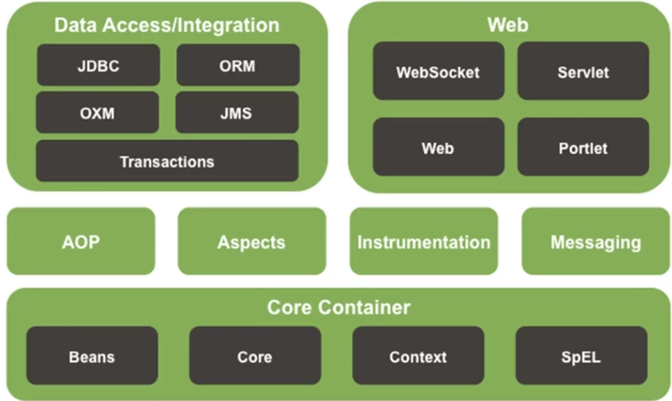

# Spring

* 简化开发
    * IOC
    * AOP
        * 事务处理

* 框架整合
    * Mybatis
    * Mybitis-plus
    * ...

1. Spring framework
2. Spring boot
3. Spring cloud

# Spring framework

* Core container

    * Beans 
    * Core
    * Context
    * SpEl

* AOP: 面向切面编程

* Aspects: AOP思想实现

* Data access/integration

    * JDBC
    * ORM
    * OXM
    * JMS
    * Transaction 事务

    

# 学习顺序

1. Core container
    1. Ioc
    2. DI
2. Data Access/Integration
3. AOP
4. Aspects
5. Transaction

## Core Container

IoC (Inversion of control) 控制反转

* 对象的创建控制权由程序转移到**外部**, 这种思想成为控制反转
* 目的是为了**解耦**

Spring 技术对IoC思想进行了实现

* Sping提供了一个容器, 成为**IoC容器**, 用来充当IoC思想中的"外部"
* IoC容器负责对象的创建, 初始化等一系列工作, 被创建或者被管理的对象在IoC容器中统称为Bean

DI (Dependency Injection) 依赖注入

* 在容器中建立 bean 与 bean 之间的依赖关系的整个过程, 称为依赖注入

目标: 充分解耦

1. 使用IoC容器管理Bean
2. 在IoC容器内将有关系的Bean进行关系绑定(DI)

